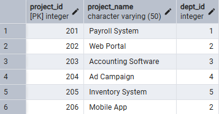
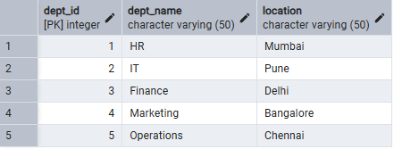
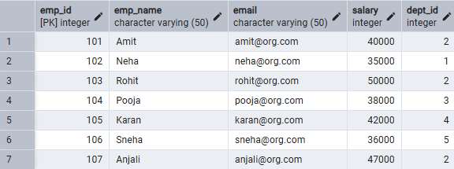
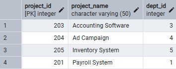
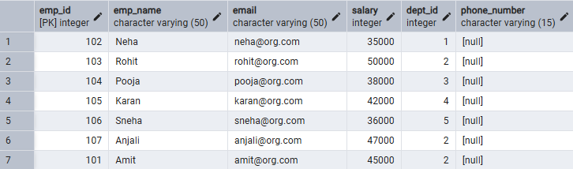

# Experiment 01.1 – DDL, DML and DCL Operations in SQL

---

## Student Information

- **Name:** Suyash  
- **UID:** 25MCI10054  
- **Branch:** MCA (Artificial Intelligence & Machine Learning)  
- **Section:** MAM-1 A  
- **Semester:** Second Semester  
- **Subject:** Technical Training  
- **Date of Performance:** 07/01/2026  

---

## Experiment Title

**Design and Implementation of a Sample Database System using DDL, DML, and DCL Commands**

---

## Aim

To design and implement a sample database system using Data Definition Language (DDL), Data Manipulation Language (DML), and Data Control Language (DCL) commands, including database creation, data manipulation, schema modification, and role-based access control to ensure data integrity and secure, read-only access for authorized users.

---

## Software Requirements

- Oracle Database Express Edition  
- PostgreSQL  
- pgAdmin  

---

## Objectives

- To gain practical experience with DDL, DML, and DCL commands  
- To design relational tables with constraints  
- To implement secure role-based access control  
- To understand schema modification techniques  
- To maintain referential integrity in databases  

---

# Database Design

The database is designed to manage **Departments, Employees, and Projects** within an organization.

### Tables:
- Departments  
- Employees  
- Projects  

### Constraints Used:
- PRIMARY KEY  
- FOREIGN KEY  
- NOT NULL  
- UNIQUE  
- CHECK  

---

# Step 1: Table Creation (DDL)

### Departments Table

```sql
CREATE TABLE Department (
    dept_id int PRIMARY KEY,
    dept_name VARCHAR(50) UNIQUE NOT NULL,
    location VARCHAR(50) NOT NULL
);
```

---

### Employees Table

```sql
CREATE TABLE Employee (
    emp_id int PRIMARY KEY,
    emp_name VARCHAR(50) NOT NULL,
    email VARCHAR(50) UNIQUE NOT NULL,
    salary int CHECK (salary > 0),
    dept_id int,
    CONSTRAINT fk_dept FOREIGN KEY (dept_id)
    REFERENCES Department(dept_id)
);
```

---

### Projects Table

```sql
CREATE TABLE Project (
    project_id int PRIMARY KEY,
    project_name VARCHAR(50) NOT NULL,
    dept_id int,
    CONSTRAINT fk_project_dept FOREIGN KEY (dept_id)
    REFERENCES Department(dept_id)
);
```

---

## Output

```

```

---

# Step 2: Data Manipulation (DML)

### Insert Records

#### Departments

```sql
INSERT INTO Department VALUES 
(1, 'HR', 'Mumbai'),
(2, 'IT', 'Pune'),
(3, 'Finance', 'Delhi'),
(4, 'Marketing', 'Bangalore'),
(5, 'Operations', 'Chennai');

```

---

#### Employees

```sql
INSERT INTO Employee VALUES
(101, 'Amit', 'amit@org.com', 40000, 2),
(102, 'Neha', 'neha@org.com', 35000, 1),
(103, 'Rohit', 'rohit@org.com', 50000, 2),
(104, 'Pooja', 'pooja@org.com', 38000, 3),
(105, 'Karan', 'karan@org.com', 42000, 4),
(106, 'Sneha', 'sneha@org.com', 36000, 5),
(107, 'Anjali', 'anjali@org.com', 47000, 2);
```

---

#### Projects

```sql
INSERT INTO Project VALUES 
(201, 'Payroll System', 1),
(202, 'Web Portal', 2),
(203, 'Accounting Software', 3),
(204, 'Ad Campaign', 4),
(205, 'Inventory System', 5),
(206, 'Mobile App', 2);
```

---






---

# Step 3: UPDATE Operations

### Change an employee’s salary

```sql
UPDATE Employee
SET salary = 45000
WHERE emp_id = 101;
```


---

# Step 4: DELETE Operations

```sql
DELETE FROM Projects
WHERE dept_id = 2;
```

---

## Output

```

```


---

# Step 5: Access Control & Security (DCL)

### Create Role

```sql
CREATE ROLE report_user LOGIN PASSWORD 'report123';
```

---

### Grant SELECT Privileges

```sql
GRANT SELECT ON Department TO report_user;
GRANT SELECT ON Employee TO report_user;
GRANT SELECT ON Project TO report_user;

```

---

### Revoke CREATE Privilege

```sql
REVOKE CREATE ON SCHEMA public FROM report_user;
```

---

### Enforce Read-Only Access

```sql
REVOKE INSERT, UPDATE, DELETE ON ALL TABLES IN SCHEMA public FROM report_user;
```


---

# Step 6: Schema Modification

### Add Column

```sql
ALTER TABLE Employee
ADD phone_number VARCHAR(15);
```

---

### Drop Table

```sql
DROP TABLE Projects;
```

---

## Output


---

# Learning Outcomes

- Understood the basics of relational database design using tables, keys, and relationships.  
- Learned to apply primary and foreign key constraints to maintain data integrity.  
- Gained hands-on experience with INSERT, UPDATE, and DELETE operations.  
- Understood role-based access control using GRANT and REVOKE.  
- Learned how to create read-only users for secure data access.  
- Practiced ALTER TABLE and DROP TABLE commands for schema management.  

---

## Conclusion

This experiment provided practical exposure to core SQL concepts including DDL, DML, and DCL commands. It strengthened understanding of database security, referential integrity, and schema management, which are essential for real-world enterprise database systems.

---