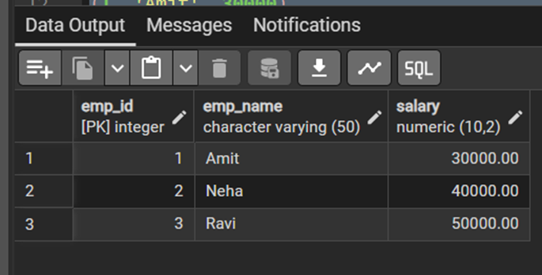
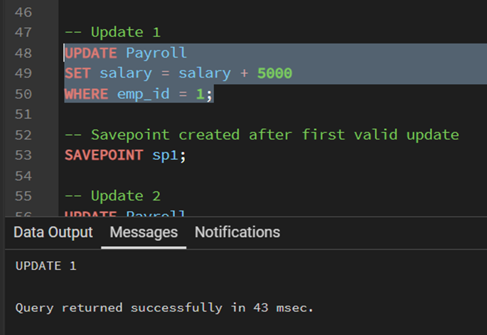
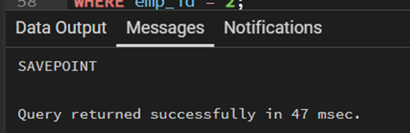
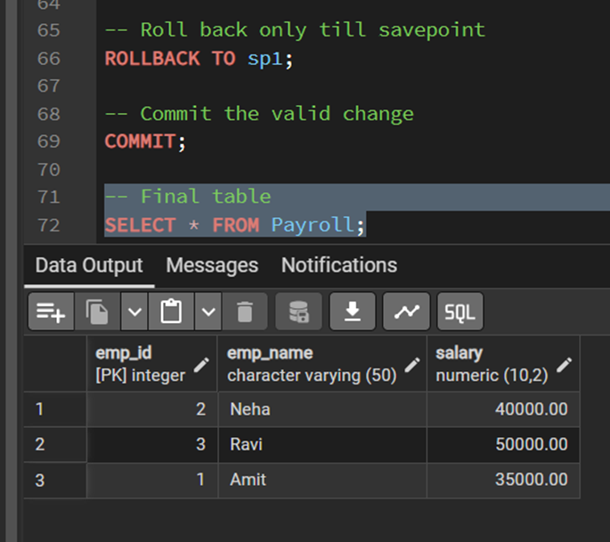

# **Worksheet – Transaction**  

---

## 👨‍🎓 **Student Details**  
**Name:** Suyash  
**UID:** 25MCI10054  
**Branch:** MCA (AI & ML)  
**Semester:** 2nd  
**Section/Group:** 25MAM1(A)  
**Subject:** Technical training -1  
 

---

## 🎯 **Aim of the Session**
To understand and apply transaction control in PostgreSQL using BEGIN, COMMIT, ROLLBACK, and SAVEPOINT to maintain data integrity during database operations.

---

## 💻 **Software Requirements**
- PostgreSQL (Database Server)  
- pgAdmin
- Windows Operating System  

---

## 📌 **Objectives**  
Apply transaction control commands for safe and reliable database updates.

---

## 🛠️ **Theory**  
Transaction control in PostgreSQL ensures that a group of database operations is executed safely as a single unit. Using BEGIN, a transaction starts; COMMIT permanently saves the changes, while ROLLBACK undoes them if an error occurs. SAVEPOINT allows partial rollback to a specific point within a transaction. These commands help maintain data integrity and consistency, especially during complex or multi-step operations.

---

# ⚙️ **Practical/Experiment Steps**

## Step 0: Table creation and data insertion.

**Code**
```sql
Create table payroll(
emp_id int primary key,
emp_name varchar(50),
salary decimal(10,2) check(salary>0)
);

Insert into payroll values
(1,'Amit',30000),
(2,'Neha',40000),
(3,'Ravi',50000);
```
**Output**
<br>


---

## Step 1: Transaction with savepoint.

**Code**
```sql
begin;

update payroll
set salary=salary+5000
where emp_id=1;

savepoint sp1;

update payroll
set salary=salary+7000
where emp_id=2;

update payroll
set salary=-1000
where emp_id=3;

rollback to sp1;

commit;
select * from payroll;
```
**Output**
<br>
First valid Update before savepoint
<br>


<br>
Savepoint created successfully
<br>


<br>
Final result after rollback to savepoint and commit
<br>


---
## 📘 **Learning Outcomes**
- BEGIN starts a transaction block for grouping multiple SQL commands.
- ROLLBACK cancels changes made inside the transaction.
- SAVEPOINT allows partial rollback without losing all valid updates.
- CHECK constraint ensures salary remains greater than zero.
- PostgreSQL transaction control helps maintain consistency and data integrity.
---