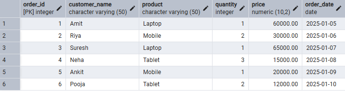
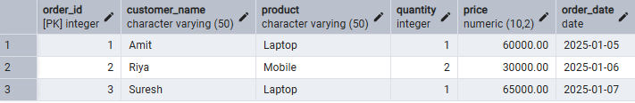
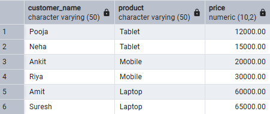
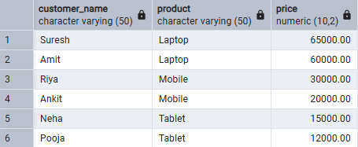
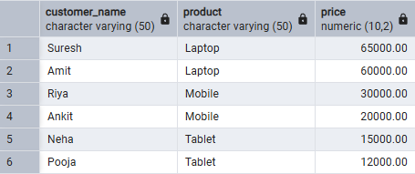
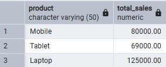
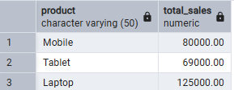
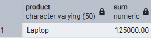

# Experiment 02 – SQL Filtering, Grouping and Sorting

## Student Information
- Name: Suyash  
- UID: 25MCI10054  
- Branch: MCA (AI & ML)  
- Section: MAM-1 A  
- Semester: Second Semester  
- Subject: Technical Skills  
- Date of Performance: 12/01/2026  

---

## Aim
To design and implement a sample database system using SQL commands to perform filtering, sorting, grouping, and aggregation operations and to understand the difference between row-level and group-level filtering.

---

## Software Requirements
- PostgreSQL  

---

## Objectives
- Retrieve specific data using filtering conditions  
- Sort query results using single and multiple attributes  
- Perform aggregation using grouping techniques  
- Apply conditions on aggregated data  
- Understand real-world analytical SQL queries  

---

## Step 1: Table Creation

```sql
CREATE TABLE customer_orders (
    order_id SERIAL PRIMARY KEY,
    customer_name VARCHAR(50),
    product VARCHAR(50),
    quantity INT,
    price NUMERIC(10,2),
    order_date DATE
);

```

---

## Step 1.1: Insert Sample Data

```sql
INSERT INTO customer_orders (customer_name, product, quantity, price, order_date) VALUES
('Amit', 'Laptop', 1, 60000, '2025-01-05'),
('Riya', 'Mobile', 2, 30000, '2025-01-06'),
('Suresh', 'Laptop', 1, 65000, '2025-01-07'),
('Neha', 'Tablet', 3, 15000, '2025-01-08'),
('Ankit', 'Mobile', 1, 20000, '2025-01-09'),
('Pooja', 'Tablet', 2, 12000, '2025-01-10');

```

### Output:

## Step 2: Filtering Data

### Without CASE
```sql
SELECT * 
FROM customer_orders
WHERE price > 25000;
```

### With CASE
```sql
SELECT *
FROM customer_orders
WHERE 
    CASE 
        WHEN Price > 25000 THEN 1
        ELSE 0
    END = 1;
```

### Output:

---

## Step 3: Sorting Data

```sql
SELECT customer_name, product, price FROM customer_orders ORDER BY price ASC;

SELECT customer_name, product, price FROM customer_orders ORDER BY price DESC;

SELECT customer_name, product, price FROM customer_orders ORDER BY product ASC, price DESC;
```

### Output:




---

## Step 4: Grouping and Aggregation

```sql
SELECT product, SUM(price * quantity) AS total_sales
FROM customer_orders
GROUP BY product;
```


### Output:


---

## Step 5: Conditions on Aggregated Data


```sql
SELECT product, SUM(price * quantity) AS total_sales
FROM customer_orders
GROUP BY product
HAVING SUM(price * quantity) > 50000;
```

### Output:


---

## Step 6: Incorrect vs Correct Aggregation

### Incorrect
```sql
SELECT product, SUM(price)
FROM customer_orders
WHERE SUM(price) > 50000
GROUP BY product;
```

### Correct
```sql
SELECT product, SUM(price)
FROM customer_orders
GROUP BY product
HAVING SUM(price) > 50000;
```



## Learning Outcomes
- Ability to create relational database tables
- Understanding of row-level filtering using WHERE
- Understanding of group-level filtering using HAVING
- Practical usage of CASE statements
- Application of aggregate functions
- Clear understanding of SQL execution order

---

## Conclusion
This experiment enhanced understanding of SQL analytical queries including filtering, sorting, grouping, and aggregation, which are essential for real-world database applications and interviews.