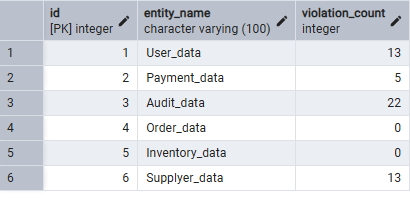
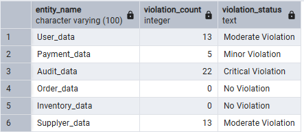
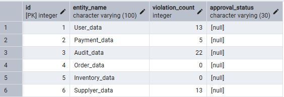
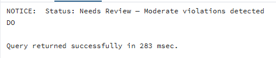
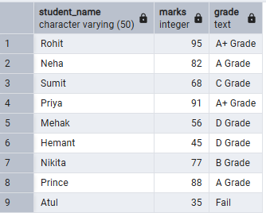
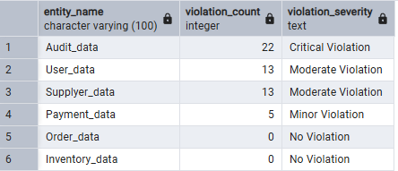

# Experiment 03 – Conditional Logic Using CASE and IF–ELSE

## Student Information
- Name: Suyash  
- UID: 25MCI10054  
- Branch: MCA (AI & ML)  
- Section: MAM-1 A  
- Semester: Second Semester  
- Subject: DBMS Lab  
- Date of Performance: 27/01/2026  

---

## Aim
To implement conditional decision-making logic in PostgreSQL using IF–ELSE constructs and CASE expressions for classification, validation, and rule-based data processing 

---

## Software Requirements
- PostgreSQL (Database Server)  

---

## Objectives
- To understand conditional execution in SQL 
- To implement decision-making logic using CASE expressions 
- To simulate real-world rule validation scenarios 
- To classify data based on multiple conditions 
- To strengthen SQL logic skills required in interviews and backend systems
---
## **Practical / Experiment Steps**  
- Create a sample table representing Violation 
- Insert realistic records into the table 
- Classifying Data Using CASE Expression 
- Applying CASE Logic in Data Updates 
- Implementing IF–ELSE Logic Using PL/pgSQL 
- Real-World Classification Scenario (Grading System) 
- Using CASE for Custom Sorting

---
# **Procedure of the Practical**

## Step 1: Table Creation

```sql
CREATE TABLE Violations ( 
id INT PRIMARY KEY,              
Entity_Name VARCHAR(100),        
Violation_count INT               
);

```


---

### Insert Sample Data

```sql
INSERT INTO Violations VALUES 
(1, 'User_data', 13), 
(2, 'Payment_data', 5), 
(3, 'Audit_data', 22), 
(4, 'Order_data', 0), 
(5, 'Inventory_data', 0), 
(6, 'Supplyer_data', 13);  
```

### Output:


## Step 2: Classifying Data Using CASE Expression 

```sql
SELECT  
Entity_name, 
Violation_count, 
CASE 
WHEN violation_count = 0 THEN 'No Violation' 
WHEN violation_count BETWEEN 1 AND 5 THEN 'Minor Violation' 
WHEN violation_count BETWEEN 6 AND 15 THEN 'Moderate Violation' 
ELSE 'Critical Violation' 
END AS Violation_Status 
FROM Violations; 
```

### Output:

---

## Step 3:  Applying CASE Logic in Data Updates
### Alter Table
```sql
ALTER TABLE Violations 
ADD COLUMN approval_status VARCHAR(30); 
```



###  Update Table
```sql
UPDATE Violations 
SET approval_status = 
CASE 
WHEN violation_count = 0 THEN 'Approved' 
WHEN violation_count BETWEEN 1 AND 15 THEN 'Needs Review' 
ELSE 'Rejected' 
END;
```


---

## Step 4: Implementing IF–ELSE Logic Using PL/pgSQL 

```sql
DO $$ 
DECLARE 
v_violation_count INT := 12;   -- Change value to test output 
BEGIN 
IF v_violation_count = 0 THEN 
RAISE NOTICE 'Status: Approved — No violations found'; 
ELSIF v_violation_count BETWEEN 1 AND 5 THEN 
RAISE NOTICE 'Status: Needs Review — Minor violations detected'; 
ELSIF v_violation_count BETWEEN 6 AND 15 THEN 
RAISE NOTICE 'Status: Needs Review — Moderate violations detected'; 
ELSE 
RAISE NOTICE 'Status: Rejected — Critical violations detected'; 
END IF; 
END $$;
```


### Output:


---

## Step 5: Real-World Classification Scenario (Grading System) 

### Table creation 
```sql
CREATE TABLE Grades ( 
student_id SERIAL PRIMARY KEY, 
student_name VARCHAR(50), 
marks INT 
); 
```
### Data Insertion 
```sql
INSERT INTO Grades (student_name, marks) VALUES 
('Rohit', 95), 
('Neha', 82), 
('Sumit', 68), 
('Priya', 91), 
('Mehak', 56), 
('Hemant', 45), 
('Nikita', 77), 
('Prince', 88), 
('Atul', 35); 
```
### Grading
```sql
SELECT  
student_name, 
marks, 
CASE 
WHEN marks >= 90 THEN 'A+ Grade' 
WHEN marks BETWEEN 80 AND 89 THEN 'A Grade' 
WHEN marks BETWEEN 70 AND 79 THEN 'B Grade' 
WHEN marks BETWEEN 60 AND 69 THEN 'C Grade' 
WHEN marks BETWEEN 40 AND 59 THEN 'D Grade' 
ELSE 'Fail' 
END AS Grade 
FROM Grades;
```
### Output:


---
## Step 6: Using CASE for Custom Sorting 

```sql
SELECT  
entity_name, 
violation_count, 
CASE 
WHEN violation_count > 15 THEN 'Critical Violation' 
WHEN violation_count BETWEEN 6 AND 15 THEN 'Moderate Violation' 
WHEN violation_count BETWEEN 1 AND 5 THEN 'Minor Violation' 
ELSE 'No Violation' 
END AS Violation_Severity 
FROM Violations 
ORDER BY 
CASE 
WHEN violation_count > 15 THEN 1    
WHEN violation_count BETWEEN 6 AND 15 THEN 2 
WHEN violation_count BETWEEN 1 AND 5 THEN 3 
ELSE 4                               
END; 

```
### Output:

--

## Learning Outcomes
This experiment demonstrates how conditional logic is implemented in PostgreSQL using 
CASE expressions and IF–ELSE constructs. 
Students gain strong command over rule-based SQL logic, which is essential for: 
- Backend systems 
- Analytics 
- Compliance reporting 
- Placement and technical interviews

---


## 📂 **Repository Contents**
- README.md  
- Worksheet (Word & PDF)  
- SQL Queries  
- Screenshots  
- Leetcode 