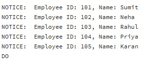
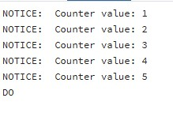
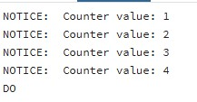
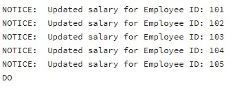
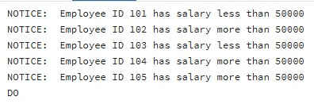

# Experiment 03 –  Iterative Control Structures in PostgreSQL

## Student Information
- Name: Suyash  
- UID: 25MCI10054  
- Branch: MCA (AI & ML)  
- Section: MAM-1 A  
- Semester: Second Semester  
- Subject: Technical Training - I
- Date of Performance: 03/02/2026

---

## Experiment Title
Implementation of Iterative Control Structures using FOR, WHILE, and LOOP in PostgreSQL

---

## Aim
To understand and implement iterative control structures in PostgreSQL conceptually, including FOR loops, WHILE loops, and LOOP constructs, for repeated execution of database logic.


## Tools Used
- PostgreSQL
- pgAdmin

---

## Objectives
- To understand why iteration is required in database programming  
- To learn the purpose and behavior of FOR, WHILE, and LOOP constructs  
- To understand how repeated data processing is handled in databases  
- To relate loop concepts to real-world batch processing scenarios  
- To strengthen conceptual knowledge of procedural SQL used in enterprise systems  

---

## Example 1: FOR Loop – Simple Iteration

```sql
do $$  
begin  
for i in 1..5 loop  
raise notice 'Iteration Number: %', i;  
end loop;  
end;  
$$ ; 

```

### Output


---

## Example 2: FOR Loop with Query (Row-by-Row Processing)

```sql
do $$ 
declare  
rec RECORD;  
BEGIN 
FOR rec IN (SELECT emp_id, emp_name FROM employees) LOOP 
raise notice 'Employee ID: %, Name: %', rec.emp_id, rec.emp_name; 
END LOOP; 
END; 
$$; 
```

### Output


---

## Example 3: WHILE Loop – Conditional Iteration

```sql
do $$  
declare  
counter INT := 1;  
begin  
while counter <= 5 loop  
raise notice 'Counter value: %', counter;  
counter := counter + 1;  
end loop;  
end;  
$$ ; 

```

### Output


---

## Example 4: LOOP with EXIT WHEN

```sql
do $$  
declare  
counter int := 1;  
begin  
loop  
raise notice 'Counter value: %', counter;  
counter := counter + 1;  
exit when counter > 5;  
end loop;  
end;  
$$ ; 

```

### Output


---

## Example 5: Salary Increment Using FOR Loop

```sql
do $$  
declare  
rec RECORD;  
begin  
for rec in  
select emp_id, salary from employees  
loop  
update employees  
set salary = salary * 1.10  
where emp_id = rec.emp_id;  
raise notice 'Updated salary for Employee ID: %', rec.emp_id;  
end loop;  
end;  
$$ ;
```

### Output


---

## Example 6: LOOP with IF Condition

```sql
do $$  
declare  
rec RECORD;  
begin  
for rec in  
select emp_id, salary from employees  
loop  
if rec.salary > 50000 then  
raise notice 'Employee ID % has salary more than 50000', rec.emp_id;  
else  
raise notice 'Employee ID % has salary less than 50000', rec.emp_id;  
end if;  
end loop;  
end;  
$$;
```

### Output


---

## Learning Outcomes

- Understand the need for iteration in database applications.
- Identify and use different loop types (FOR, WHILE, LOOP).
- Implement fixed and query-based repetition for row processing.
- Apply conditional and exit-controlled loops for automation tasks.
- Use PL/pgSQL loops in real-world scenarios like payroll, reporting, and batch processing.

---
