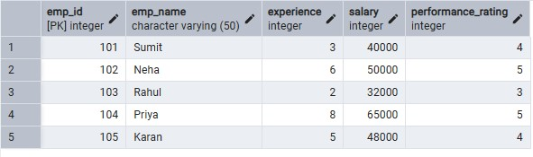
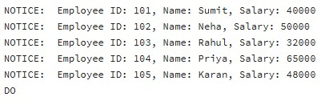

# Experiment 05 –  Implementation of Cursors for Row-by-Row Processing in PostgreSQL

## Student Information
- Name: Suyash  
- UID: 25MCI10054  
- Branch: MCA (AI & ML)  
- Section: MAM-1 A  
- Semester: Second Semester  
- Subject: Technical Training - I
- Date of Performance: 03/03/2026

---

## Experiment Title
Implementation of Cursors for Row-by-Row Processing in PostgreSQL

---

## Aim
To gain hands-on experience in creating and using cursors for sequential row-by-row processing and applying procedural logic for complex business operations in PostgreSQL.


## Tools Used
- PostgreSQL
- pgAdmin

---

## Objectives
- To understand sequential data access using cursors 
- To perform row-level manipulation using procedural logic 
- To learn the lifecycle of a cursor (DECLARE → OPEN → FETCH → CLOSE) 
- To handle exceptions and cursor termination conditions 
- To relate cursor concepts with real-world enterprise applications 

---
## Theory

While SQL is generally set-oriented, certain tasks require a procedural approach where we 
process one row at a time. This is where Cursors are used: 
1. Cursor Types:
Cursors can be Implicit (managed by the system) or Explicit (defined by the developer). They can also be Forward-Only (moving only toward the end) or Scrollable (moving back and forth). 
2. The Lifecycle: * DECLARE: Defines the SQL query for the cursor. 
OPEN: Executes the query and establishes the result set. 
FETCH: Retrieves a specific row into variables for processing. 
CLOSE: Releases the current result set. 
DEALLOCATE: Removes the cursor definition from memory. 
3. Use Case: Cursors are ideal for generating row-specific reports, updating balances based 
on complex historical data, or migrating data where each record needs individual 
validation


## Experiment Steps
## Step 1 : Simple Forward-Only Cursor 

```sql
CREATE TABLE employees ( 
emp_id INT PRIMARY KEY, 
emp_name VARCHAR(50), 
experience INT, 
salary INT, 
performance_rating INT 
); 
INSERT INTO employees VALUES 
(101, 'Sumit', 3, 40000, 4), 
(102, 'Neha', 6, 50000, 5), 
(103, 'Rahul', 2, 32000, 3), 
(104, 'Priya', 8, 65000, 5), 
(105, 'Karan', 5, 48000, 4); 

```

### Employees Table 


```sql
DO $$ 
DECLARE 
emp_record RECORD; 
emp_cursor CURSOR FOR 
SELECT emp_id, emp_name, salary FROM employees; 
BEGIN 
OPEN emp_cursor; 
LOOP 
FETCH emp_cursor INTO emp_record; 
EXIT WHEN NOT FOUND; 
RAISE NOTICE 'Employee ID: %, Name: %, Salary: %', 
emp_record.emp_id, emp_record.emp_name, emp_record.salary; 
END LOOP; 
CLOSE emp_cursor; 
END; 
$$;
```

### Output 



---

## Step 2: Salary Update Using Cursor (Experience + Performance Logic)

```sql
DO $$ 
DECLARE 
emp_record RECORD; 
emp_cursor CURSOR FOR 
SELECT * FROM employees; 
bonus NUMERIC; 
BEGIN 
OPEN emp_cursor; 
LOOP 
FETCH emp_cursor INTO emp_record; 
EXIT WHEN NOT FOUND; 
bonus := emp_record.salary * 
(emp_record.experience * 0.02 + 
emp_record.performance_rating * 0.03); 
UPDATE employees 
SET salary = salary + bonus 
WHERE emp_id = emp_record.emp_id; 
RAISE NOTICE 'Salary updated for Employee ID: %', 
emp_record.emp_id; 
END LOOP; 
CLOSE emp_cursor; 
END; 
$$; 
```

### Output

### Table after Updation

---

## Step 3: Exception Handling for Empty Result Set 

```sql
DO $$ 
DECLARE 
emp_record RECORD; 
emp_cursor CURSOR FOR 
SELECT * FROM employees WHERE salary > 100000; 
BEGIN 
OPEN emp_cursor; 
FETCH emp_cursor INTO emp_record; 
IF NOT FOUND THEN 
RAISE NOTICE 'No employee found with given condition'; 
END IF; 
CLOSE emp_cursor; 
END; 
$$; 
```

### Output


---


## Learning Outcomes

- Understand sequential row-by-row processing using cursors 
- Implement cursor lifecycle correctly 
- Apply complex business logic using procedural SQL 
- Handle empty result sets and termination conditions 
- Use cursors in enterprise scenarios like payroll and reporting 

---
## Result  

This experiment demonstrates how cursors enable row-wise data processing in PostgreSQL. 
Students learn cursor declaration, fetching, updating records, and proper resource management, which are essential for implementing complex business logic in enterprise-grade database applications.

--- 