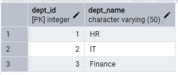
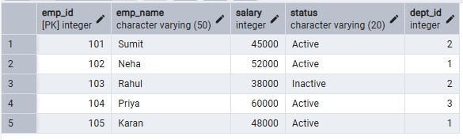
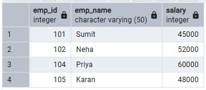
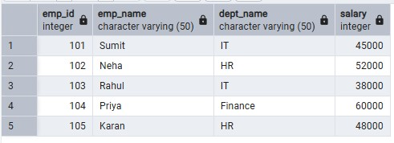
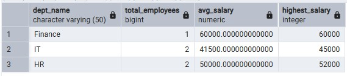

# Experiment 06 –  Implementation of Views in PostgreSQL 

## Student Information
- Name: Suyash  
- UID: 25MCI10054  
- Branch: MCA (AI & ML)  
- Section: MAM-1 A  
- Semester: Second Semester  
- Subject: Technical Training - I
- Date of Performance: 03/03/2026

---

## Experiment Title
Implementation of Views in PostgreSQL 

---

## Aim
To learn how to create, query, and manage views in PostgreSQL to simplify database queries and provide a layer of abstraction for end-users.


## Tools Used
- PostgreSQL
- pgAdmin

---

## Objectives
- To understand how views provide data abstraction 
- To learn how to restrict access to sensitive data using views 
- To simplify complex queries using virtual tables 
- To understand creation, replacement, and deletion of views 
- To relate view concepts to real-world applications

---
## Theory

A View is essentially a virtual table based on the result-set of an SQL statement. It does not contain data of its own but dynamically pulls data from the underlying "base tables". 
- Simple Views: Created from a single table without any aggregate functions or grouping. These are often updatable. 

- Complex Views: Created from multiple tables using JOINs, or including GROUP BY and aggregate functions. These provide a consolidated summary of the database. 

- Security Layer: In enterprise environments, views are used to grant permissions on specific subsets of data. For example, a "SalaryView" might exclude the "Employee_SSN" or "Home_Address" columns for privacy.

- Benefits: They simplify the user experience, ensure data consistency across reports, and reduce the risk of accidental data modification by providing read-only abstractions. 

### Table Creation
```sql
CREATE TABLE departments ( 
dept_id INT PRIMARY KEY, 
dept_name VARCHAR(50) 
); 

CREATE TABLE employees ( 
emp_id INT PRIMARY KEY, 
emp_name VARCHAR(50), 
salary INT, 
status VARCHAR(20), 
dept_id INT, 
FOREIGN KEY (dept_id) REFERENCES departments(dept_id) 
);

INSERT INTO departments VALUES 
(1, 'HR'), 
(2, 'IT'), 
(3, 'Finance'); 

INSERT INTO employees VALUES 
(101, 'Sumit', 45000, 'Active', 2), 
(102, 'Neha', 52000, 'Active', 1), 
(103, 'Rahul', 38000, 'Inactive', 2), 
(104, 'Priya', 60000, 'Active', 3), 
(105, 'Karan', 48000, 'Active', 1);
```
### Department Table 

### Employees Table 



## Experiment Steps

## Step 1 : Creating a Simple View for Data Filtering 

```sql
CREATE VIEW active_employees AS 
SELECT emp_id, emp_name, salary 
FROM employees 
WHERE status = 'Active'; 
SELECT * FROM active_employees; 
```

### Output 



---

## Step 2: Salary Update Using Cursor (Experience + Performance Logic)

```sql
CREATE VIEW employee_department AS 
SELECT e.emp_id, e.emp_name, d.dept_name, e.salary 
FROM employees e 
JOIN departments d 
ON e.dept_id = d.dept_id; 
SELECT * FROM employee_department; 
```

### Output

---

## Step 3:  Creating an Advanced Summarization View 

```sql
CREATE VIEW department_salary_summary AS 
SELECT d.dept_name, 
COUNT(e.emp_id) AS total_employees, 
AVG(e.salary) AS avg_salary, 
MAX(e.salary) AS highest_salary 
FROM employees e 
JOIN departments d 
ON e.dept_id = d.dept_id 
GROUP BY d.dept_name;

SELECT * FROM department_salary_summary;
```

### Output


---


## Learning Outcomes

- Understand how views provide abstraction and simplify queries 
- Learn to create simple and complex views 
- Implement views for data security and restricted access 
- Use views for real-world reporting and analysis 
- Demonstrate proper syntax for view management  
---

## Result  

This experiment demonstrates how views can be used to simplify complex SQL queries, enhance security by restricting sensitive data, and provide a logical layer for end-users. Students gain practical knowledge of creating, querying, updating, and dropping views in PostgreSQL for enterprise-level applications. 

--- 