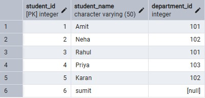
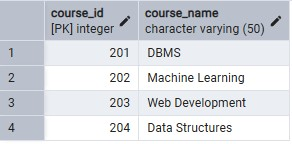
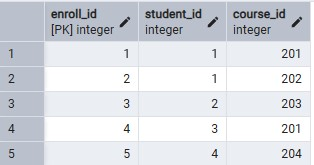
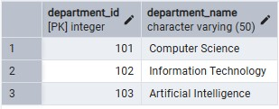

# 📘 Worksheet 7 – SQL Joins Implementation

## 👨‍🎓 Student Details

* **Student Name:** Suyash
* **UID:** 25MCI10054
* **Branch:** MCA (AI & ML)
* **Section/Group:** MAM-1 A
* **Semester:** 2nd
* **Date of Performance:** 31/03/2026
* **Subject Name:** Technical Training - I
* **Subject Code:** 25CAP-652

---

## 🎯 Aim

Implementation of joins in PostgreSQL (inner join, left join, right join, self join and cross join)

---

## 🛠️ Tools Used

* PostgreSQL
* pgAdmin
* Windows Operating System

---

## 🎯 Objectives

Apply joins to a real-world database schema (e.g., Students, Courses, Enrollments, Departments)

---

## 📖 Theory

A JOIN in SQL is used to combine rows from two or more tables based on a related column between them. Joins are essential in relational databases because data is often stored in multiple tables to reduce redundancy and improve organization.

### Types of Joins Used in this Experiment:

1. **INNER JOIN:**
   Returns only the matching records from both tables.

2. **LEFT JOIN:**
   Returns all records from the left table and the matching records from the right table. If no match is found, NULL values are returned for the right table columns.

3. **RIGHT JOIN:**
   Returns all records from the right table and the matching records from the left table. If no match is found, NULL values are returned for the left table columns.

4. **SELF JOIN:**
   A table is joined with itself to represent relationships within the same table, such as mentor-student or manager-employee relationships.

5. **CROSS JOIN:**
   Returns the Cartesian product of two tables, i.e., all possible combinations of rows from both tables.

---

## ⚙️ Experiment Steps

### Step 0: Creating tables and inserting records

```sql id="s9u9pd"
CREATE TABLE students ( 
    student_id INT PRIMARY KEY, 
    student_name VARCHAR(50), 
    department_id INT 
); 

CREATE TABLE courses ( 
    course_id INT PRIMARY KEY, 
    course_name VARCHAR(50) 
); 

CREATE TABLE enrollments ( 
    enroll_id INT PRIMARY KEY, 
    student_id INT, 
    course_id INT 
); 

CREATE TABLE departments ( 
    department_id INT PRIMARY KEY, 
    department_name VARCHAR(50)  
); 
```

```sql id="1d76qk"
INSERT INTO students VALUES 
(1, 'Amit', 101), 
(2, 'Neha', 102), 
(3, 'Rahul', 101), 
(4, 'Priya', 103), 
(5, 'Karan', 102), 
(6, 'sumit' , NULL); 

SELECT * FROM students;
```

```sql id="2s4ry3"
INSERT INTO courses VALUES 
(201, 'DBMS'), 
(202, 'Machine Learning'), 
(203, 'Web Development'), 
(204, 'Data Structures'); 

SELECT * FROM courses;
```

```sql id="6b4rqn"
INSERT INTO enrollments VALUES 
(1, 1, 201), 
(2, 1, 202), 
(3, 2, 203), 
(4, 3, 201), 
(5, 4, 204); 

SELECT * FROM enrollments;
```

```sql id="kq8p35"
INSERT INTO departments VALUES 
(101, 'Computer Science'), 
(102, 'Information Technology'), 
(103, 'Artificial Intelligence'); 

SELECT * FROM departments;
```

---

### Step 1: Queries to list students with their enrolled courses (INNER JOIN)

```sql id="x4b0fs"
SELECT s.student_id, s.student_name, c.course_name 
FROM students s 
INNER JOIN enrollments e ON s.student_id = e.student_id 
INNER JOIN courses c ON e.course_id = c.course_id;
```
### Output 

---

### Step 2:  Find students not enrolled in any course (LEFT JOIN). 

```sql id="nsd7v6"
SELECT s.student_id, s.student_name 
FROM students s 
LEFT JOIN enrollments e ON s.student_id = e.student_id 
WHERE e.course_id IS NULL;
```
### Output 

---

### Step 3:  Display all courses with or without enrolled students (RIGHT JOIN).

```sql id="e7m3bb"
SELECT s.student_name, c.course_name 
FROM students s 
RIGHT JOIN enrollments e ON s.student_id = e.student_id 
RIGHT JOIN courses c ON e.course_id = c.course_id;
```
### Output 

---

### Step 4: Show students with department info using SELF JOIN or multiple joins. 

```sql id="8yzn5j"
SELECT s.student_id, s.student_name, d.department_name 
FROM students s 
JOIN departments d ON s.department_id = d.department_id;
```
### Output 

---

### Step 5: Display all possible student-course combinations (CROSS JOIN). (Oracle, SAP, IBM, Microsoft) 

```sql id="y4a1rl"
SELECT s.student_name, c.course_name 
FROM students s 
CROSS JOIN courses c;
```
### Output 

---

## 📊 Learning Outcome

* Join Understanding: I learned how to use different types of SQL joins to retrieve related data from multiple tables.
* Practical Database Skills: I understood how real-world schemas such as Students, Courses, Enrollments, and Departments are related in a relational database.
* Data Analysis Ability: I learned how to identify matching and non-matching records using INNER JOIN, LEFT JOIN, and RIGHT JOIN.
* Advanced SQL Usage: I understood the use of SELF JOIN for hierarchical relationships and CROSS JOIN for generating all possible combinations.
* PostgreSQL Practice: I gained hands-on experience in writing and executing SQL queries in PostgreSQL / pgAdmin.

---

## ✅ Result

This experiment demonstrates how different SQL joins are used to combine and retrieve data from multiple tables in PostgreSQL.
