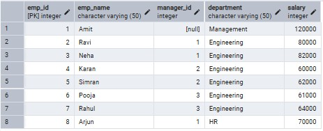
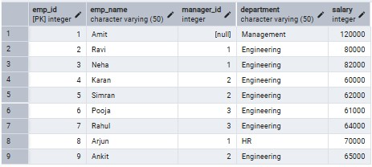
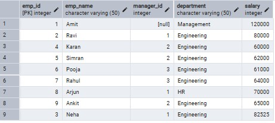
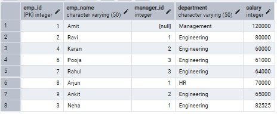

# 📘 Worksheet – Stored Procedures using Employees Table

## 👨‍🎓 Student Details

* **Student Name:** Suyash
* **UID:** 25MCI10054
* **Branch:** MCA (AI & ML)
* **Section/Group:** MAM-1 A
* **Semester:** 2nd
* **Subject Name:** Technical Training - I
* **Subject Code:** 25CAP-652

---

## 🎯 Aim

To apply the concept of Stored Procedures in database operations in order to perform tasks like insertion, updating, deletion, and retrieval of data efficiently, securely, and in a reusable manner within the database system.

---

## 🛠️ Tools Used

* PostgreSQL
* pgAdmin
* Windows Operating System

---

## 🎯 Objectives

Apply stored procedure concepts for database operations 

---

## 📖 Theory

A Stored Procedure is a precompiled collection of SQL statements stored in the database that can be executed as a single unit. It helps in improving performance, security, and code reusability. 

### Features of Stored Procedures 
* Reusability 
* Better Performance 
* Improved Security 
* Reduced Network Traffic 
* Modular Programming

---

## ⚙️ Experiment Steps

### Step 0: Create Table and Insert Data

```sql id="emp1"
CREATE TABLE Employees ( 
emp_id INT PRIMARY KEY, 
emp_name VARCHAR(50), 
manager_id INT, 
department VARCHAR(50), 
salary INT 
); 

INSERT INTO Employees VALUES 
(1, 'Amit', NULL, 'Management', 120000), 
(2, 'Ravi', 1, 'Engineering', 80000), 
(3, 'Neha', 1, 'Engineering', 82000), 
(4, 'Karan', 2, 'Engineering', 60000), 
(5, 'Simran', 2, 'Engineering', 62000), 
(6, 'Pooja', 3, 'Engineering', 61000), 
(7, 'Rahul', 3, 'Engineering', 64000), 
(8, 'Arjun', 1, 'HR', 70000);
```
## Employees table


---

### Step 1: Insert Stored Procedure

```sql id="emp2"
CREATE OR REPLACE PROCEDURE add_employee( 
p_id INT, 
p_name VARCHAR, 
p_manager INT, 
p_dept VARCHAR, 
p_salary INT 
) 
LANGUAGE plpgsql 
AS $$ 
BEGIN 
INSERT INTO Employees VALUES (p_id, p_name, p_manager, p_dept, p_salary); 
END; 
$$;
```

#### Call

```sql id="emp3"
CALL add_employee(9, 'Ankit', 2, 'Engineering', 65000);
```
### Output: after insert data  

---

### Step 2: Update Stored Procedure

```sql id="emp4"
create or replace Procedure UPDATE_SALARY_PROCC(IN P_EMP_ID int, INOUT P_SALARY numeric(20,3) , OUT STATUS 
varchar(20)) 
AS  
$$ 
DECLARE  
CURR_SAL NUMERIC(20,3); 
BEGIN  
SELECT SALARY+P_SALARY INTO CURR_SAL FROM employees WHERE EMP_ID = P_EMP_ID; 
IF NOT FOUND THEN 
RAISE EXCEPTION 'EMPLOYEE NOT FOUND'; 
END IF ; 
UPDATE employees  
SET SALARY = CURR_SAL WHERE EMP_ID = P_EMP_ID; 
P_SALARY:= CURR_SAL; 
STATUS :='SUCCESS'; 
EXCEPTION  
WHEN OTHERS THEN  
IF SQLERRM LIKE '%EMPLOYEE NOT FOUND%' THEN  
STATUS:='EMPLOYEE NOT FOUND'; 
END IF; 
END; 
$$ LANGUAGE PLPGSQL ; 
```

#### Call

```sql id="emp5"
DO 
$$ 
DECLARE  
EMP_ID INT :=3; 
STATUS VARCHAR(20); 
SALARY NUMERIC(20,3):=525; 
BEGIN 
CALL UPDATE_SALARY_PROCC(EMP_ID ,SALARY , STATUS); 
RAISE NOTICE 'YOUR STATUS IS % AND THE UPDATED SALARY IS %',STATUS , SALARY; 
END; 
$$
```
### Output : after update salary of id 3 

---

### Step 3: Delete Stored Procedure

```sql id="emp6"
CREATE OR REPLACE PROCEDURE delete_employee( 
p_id INT 
) 
LANGUAGE plpgsql 
AS $$ 
BEGIN 
DELETE FROM Employees 
WHERE emp_id = p_id; 
END; 
$$;
```

#### Call

```sql id="emp7"
CALL delete_employee(5);
```
### Output : after deleting data of id 5 

---


## 📊 Learning Outcome

* Learned how to create and use stored procedures 
* Understood how to perform CRUD operations using procedures 
* Improved understanding of database modular programming 
* Learned how to enhance security and performance 
* Gained hands-on experience in PostgreSQL

---

## ✅ Result

This experiment demonstrates how stored procedures can be used to perform efficient and reusable database operations on an Employees table.
